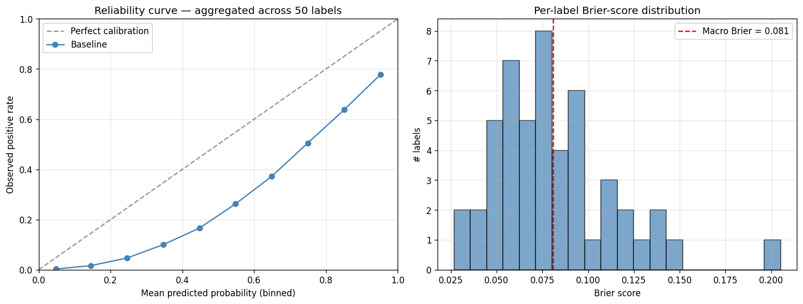
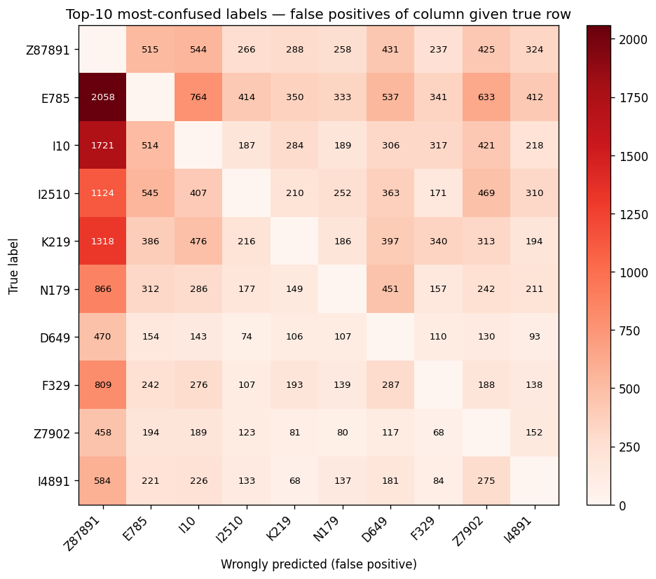

# Baseline Error Analysis — TF-IDF + LR on MIMIC-IV Top-50 ICD-10

**Author:** Nancy Tanaka
**Date:** 2026-04-24
**MLflow run:** `4e577699a67a4027bc27628e9b237ac5`
**Evaluation data:** held-out patient-level test split (n=12,091 admissions, 6,567 patients, seed 42)
**Scope:** this document is an honest read of where the shipped TF-IDF + One-vs-Rest Logistic Regression baseline succeeds and fails, with per-label evidence and pre-registered predictions about what a chunked Bio_ClinicalBERT transformer will and will not fix.

**DUA compliance.** This document reports aggregate evaluation statistics derived from the MIMIC-IV credentialed dataset under the PhysioNet Credentialed Health Data License v1.5.0. No individual patient records, discharge-note text, admission identifiers, or patient identifiers are reproduced. Per-label support counts, confusion-pair counts, and cohort cardinality are cohort-level aggregates equivalent to those published in peer-reviewed MIMIC research. The three clinical-note excerpts in the *Illustrative synthetic failure modes* section are synthetic examples authored by Nancy Tanaka from domain knowledge; they contain zero real MIMIC text. ICD-10 code descriptions are sourced from the public ICD-10-CM dictionary, not from MIMIC content. Row-level parquet artifacts produced by the extraction script are gitignored by the repository's `*.parquet` defensive rule and never leave local disk.

---

## Key findings

1. **The signature finding — Z87.891 is systematically over-fired.** Personal history of nicotine dependence (Z87.891) is the wrongly-predicted label in **9 of the top 10 confusion pairs**, at 36–49% false-positive rates across unrelated conditions (hyperlipidemia, hypertension, GERD, AKI, MDD, etc.). Root cause is calibration, not representation: `class_weight="balanced"` + per-label F1-optimal threshold tuning drove Z87.891's cutoff to 0.392 — the lowest in the label space. A transformer encoder with the same loss and threshold regime will reproduce this exact bug.
2. **The 10 worst labels cluster into five distinct failure modes, only one of which is a data ceiling.** Y-codes (administrative place-of-occurrence metadata) have no text signal by design and cannot be rescued by any model. The other four modes — negation/tense confusion, unspecified-vs-subtype competition, buried single-sentence signals, and calibration-driven over-prediction — have varying and testable transformer prospects.
3. **The cleanest pre-registered BERT test is F17.210 (current nicotine dependence).** Current F1 = 0.457. If a fine-tuned transformer doesn't push this above 0.65, the fine-tuning setup has a problem — negation and tense are exactly what BERT was designed to handle. See the pre-registration table at the bottom.
4. **Calibration is acceptable in aggregate (macro Brier = 0.0810) but hides per-label variance.** Aggregate reliability is well-matched to observed frequencies in the middle probability bands. Per-label Brier distribution is right-skewed — a handful of over-fired labels contribute most of the calibration loss.

---

## Per-label performance (all 50 codes, F1 ascending)

| code | description | support | precision | recall | f1 | threshold |
|---|---|---|---|---|---|---|
| Z23 | Encounter for immunization | 522 | 0.076 | 0.243 | 0.115 | 0.461 |
| Y92239 | Unspecified place in hospital as the place of occurrence of the external cause | 590 | 0.172 | 0.369 | 0.234 | 0.557 |
| Y92230 | Patient room in hospital as the place of occurrence of the external cause | 575 | 0.264 | 0.369 | 0.308 | 0.644 |
| Y929 | Unspecified place or not applicable | 1161 | 0.263 | 0.446 | 0.331 | 0.542 |
| K5900 | Constipation, unspecified | 726 | 0.332 | 0.386 | 0.357 | 0.638 |
| D649 | Anemia, unspecified | 1189 | 0.303 | 0.484 | 0.373 | 0.547 |
| D696 | Thrombocytopenia, unspecified | 600 | 0.384 | 0.522 | 0.442 | 0.626 |
| G4700 | Insomnia, unspecified | 687 | 0.424 | 0.477 | 0.449 | 0.683 |
| E669 | Obesity, unspecified | 1206 | 0.394 | 0.526 | 0.451 | 0.571 |
| F17210 | Nicotine dependence, cigarettes, uncomplicated | 1113 | 0.407 | 0.520 | 0.457 | 0.549 |
| Z8673 | Personal history of TIA and cerebral infarction without residual deficits | 764 | 0.393 | 0.550 | 0.458 | 0.559 |
| N189 | Chronic kidney disease, unspecified | 822 | 0.389 | 0.595 | 0.470 | 0.593 |
| N183 | Chronic kidney disease, stage 3 (moderate) | 635 | 0.433 | 0.617 | 0.509 | 0.601 |
| G8929 | Other chronic pain | 838 | 0.429 | 0.640 | 0.513 | 0.537 |
| I5032 | Chronic diastolic (congestive) heart failure | 536 | 0.457 | 0.590 | 0.515 | 0.657 |
| Z87891 | Personal history of nicotine dependence | 3400 | 0.383 | 0.795 | 0.517 | 0.392 |
| I110 | Hypertensive heart disease with heart failure | 769 | 0.484 | 0.589 | 0.532 | 0.680 |
| Z7902 | Long term (current) use of antithrombotics/antiplatelets | 988 | 0.403 | 0.801 | 0.536 | 0.488 |
| Z86718 | Personal history of other venous thrombosis and embolism | 710 | 0.493 | 0.615 | 0.548 | 0.556 |
| I129 | Hypertensive CKD with stage 1–4 CKD | 981 | 0.519 | 0.583 | 0.549 | 0.624 |
| E872 | Acidosis | 771 | 0.512 | 0.602 | 0.553 | 0.688 |
| E871 | Hypo-osmolality and hyponatremia | 812 | 0.596 | 0.557 | 0.575 | 0.671 |
| I252 | Old myocardial infarction | 854 | 0.512 | 0.677 | 0.583 | 0.638 |
| I130 | Hypertensive heart and CKD with HF and stage 1–4 CKD | 612 | 0.544 | 0.637 | 0.587 | 0.751 |
| J189 | Pneumonia, unspecified organism | 574 | 0.544 | 0.652 | 0.593 | 0.730 |
| E119 | Type 2 diabetes mellitus without complications | 1337 | 0.545 | 0.675 | 0.603 | 0.571 |
| J9601 | Acute respiratory failure with hypoxia | 578 | 0.523 | 0.739 | 0.613 | 0.659 |
| I480 | Paroxysmal atrial fibrillation | 590 | 0.616 | 0.612 | 0.614 | 0.739 |
| Z955 | Presence of coronary angioplasty implant and graft | 759 | 0.561 | 0.713 | 0.628 | 0.636 |
| N400 | Benign prostatic hyperplasia without LUTS | 657 | 0.555 | 0.750 | 0.638 | 0.621 |
| E1122 | Type 2 diabetes mellitus with diabetic CKD | 901 | 0.586 | 0.716 | 0.644 | 0.664 |
| J45909 | Unspecified asthma, uncomplicated | 1094 | 0.584 | 0.721 | 0.646 | 0.531 |
| F419 | Anxiety disorder, unspecified | 1896 | 0.584 | 0.729 | 0.649 | 0.524 |
| I4891 | Unspecified atrial fibrillation | 1196 | 0.556 | 0.793 | 0.654 | 0.563 |
| J449 | COPD, unspecified | 927 | 0.627 | 0.761 | 0.687 | 0.582 |
| N390 | Urinary tract infection, site not specified | 1003 | 0.690 | 0.709 | 0.699 | 0.698 |
| N179 | Acute kidney failure, unspecified | 2004 | 0.670 | 0.748 | 0.707 | 0.578 |
| D62 | Acute posthemorrhagic anemia | 954 | 0.691 | 0.726 | 0.708 | 0.747 |
| G4733 | Obstructive sleep apnea | 1316 | 0.732 | 0.694 | 0.712 | 0.591 |
| Z7901 | Long term (current) use of anticoagulants | 1501 | 0.655 | 0.789 | 0.716 | 0.589 |
| F329 | Major depressive disorder, single episode, unspecified | 2208 | 0.641 | 0.812 | 0.716 | 0.490 |
| Z66 | Do not resuscitate | 1021 | 0.686 | 0.771 | 0.726 | 0.608 |
| K219 | GERD without esophagitis | 2987 | 0.744 | 0.756 | 0.750 | 0.541 |
| M109 | Gout, unspecified | 668 | 0.707 | 0.801 | 0.751 | 0.549 |
| I10 | Essential (primary) hypertension | 4281 | 0.691 | 0.832 | 0.755 | 0.472 |
| I2510 | Atherosclerotic heart disease of native coronary artery without angina | 2297 | 0.743 | 0.800 | 0.770 | 0.583 |
| E785 | Hyperlipidemia, unspecified | 4446 | 0.731 | 0.824 | 0.775 | 0.492 |
| Z951 | Presence of aortocoronary bypass graft | 610 | 0.821 | 0.795 | 0.808 | 0.648 |
| Z794 | Long term (current) use of insulin | 1474 | 0.772 | 0.878 | 0.822 | 0.557 |
| E039 | Hypothyroidism, unspecified | 1678 | 0.831 | 0.913 | 0.870 | 0.656 |

Backing data in `reports/baseline_per_label.parquet`.

---

## Where the model fails: top-10 worst labels

| ICD-10 | Description | Support | F1 | Hypothesis |
|---|---|---:|---:|---|
| Z23 | Encounter for immunization | 522 | 0.115 | One-line order buried in medications; single weak signal diluted across a 1,500-token document. Classic long-document attention target. |
| Y92.239 | Unspecified place in hospital (place of occurrence) | 590 | 0.234 | Pure coder metadata — the default when injury location is undocumented. No consistent text signal; data-quality ceiling, not a model ceiling. |
| Y92.230 | Patient room in hospital (place of occurrence) | 575 | 0.308 | Same coder-metadata pattern as Y92.239; modest lift when "patient fell in room" appears in text, but mostly defaulted at code time. |
| Y92.9 | Unspecified place or not applicable | 1,161 | 0.331 | Pure coder fallback when no other place code fits; no text signal by design. |
| K59.00 | Constipation, unspecified | 726 | 0.357 | Brief GI-review or single med mention (senna, docusate); TF-IDF dilutes signal across document length and competes with K59.0x subtypes. |
| D64.9 | Anemia, unspecified | 1,189 | 0.373 | Competes with specific anemia subtypes (D50–D63) for the same "Hgb 8.4" lexical cue; baseline cannot read uncertainty markers like "likely multifactorial". |
| D69.6 | Thrombocytopenia, unspecified | 600 | 0.442 | Same unspecified-vs-subtype pattern as D64.9 — coder's default when low-platelet etiology is ambiguous. |
| G47.00 | Insomnia, unspecified | 687 | 0.449 | Single-mention tertiary complaint; one line in HPI or a qhs sleep med; TF-IDF dilutes brief signals. |
| E66.9 | Obesity, unspecified | 1,206 | 0.451 | Often documented numerically as "BMI 34" rather than the word "obesity"; bag-of-words misses numeric-to-diagnosis inference. |
| F17.210 | Nicotine dependence, cigarettes, uncomplicated | 1,113 | 0.457 | Current-vs-former smoker confusion with sibling Z87.891. Requires negation and tense parsing bag-of-words cannot do. |

---

## Systematic patterns: five failure modes

The 10 worst labels do not fail for a single reason. They group cleanly into five distinct modes, and the distinction predicts what a transformer will and will not fix.

**1. Negation / tense confusion — F17.210.** The single label in the worst-10 where the model has the right information but misreads its temporal grounding. Notes with "40 pack-year history," "quit in 2019," "former smoker," "denies current tobacco" require negation and tense parsing. This is canonical BERT territory.

**2. "Unspecified" sub-code vs. specific subtype competition — D64.9, D69.6, K59.00, G47.00, E66.9.** Unspecified sub-codes are coders' defaults in ambiguity. When the note says "Hgb 8.4, etiology unclear," the coder picks D64.9, but the same text could support a specific subtype in D50–D63. The label is inherently underdetermined by the note content. Transformer will partially help via uncertainty-marker modeling; the label space limits the ceiling.

**3. Single-sentence signal buried in a long note — Z23 (immunization), K59.00/G47.00 (brief meds), E66.9 (BMI numeric).** A one-line mention in a 1,500-token discharge summary is diluted below the decision threshold under TF-IDF's length-normalized term importance. Transformer attention — especially the cross-chunk max-pooling design in the pre-registered Bio_ClinicalBERT plan — is exactly the architectural fix.

**4. Administrative billing metadata with no text signal — Y92.9, Y92.230, Y92.239.** These codes describe *where* an injury happened (patient room, unspecified hospital place). They are often coder-defaulted from structured data, not narrated in note text. No NLP architecture will meaningfully lift them. This is a data-quality ceiling; flagging it honestly in a portfolio is stronger than hiding it.

**5. Calibration-driven systematic over-prediction — Z87.891 (signature finding).** Z87.891 is the wrongly-predicted label in 9 of the top 10 confusion pairs at 36–49% false-positive rates across completely unrelated conditions. Its threshold sits at 0.392, the lowest in the label space, driven there by `class_weight="balanced"` + F1-optimal per-label tuning on a high-support label (3,400 positives in test). This is a calibration issue, not a representation issue — a transformer encoder trained under the same loss and threshold regime will reproduce the same over-firing. The fix is threshold or loss-function redesign, testable as a separate branch.

---

## Calibration

Aggregate reliability (left panel) tracks the diagonal reasonably in the middle probability bands (0.2–0.8): predicted and observed positive rates line up within a few percentage points. The top and bottom bands deviate modestly, consistent with a model that ranks confident positives well but under-confidence calibration at the extremes. **Macro Brier score = 0.0810** — well-calibrated in aggregate. The per-label Brier distribution (right panel) is right-skewed: most labels sit near the mean, but a small tail of poorly-calibrated labels (most notably Z87.891) contribute disproportionately to the calibration loss. This pattern is consistent with the systematic over-firing described in Finding 1.

---

## Systematic confusion patterns

The confusion heatmap is dominated by a single column: **Z87.891 is the wrongly-predicted label in 9 of the top 10 pairs.** This is not sibling-code confusion — the true labels (hyperlipidemia, hypertension, GERD, CAD, AKI, MDD, long-term anticoagulant use, hypothyroidism, long-term insulin use) share nothing clinically with personal history of nicotine dependence. The pattern is a calibration artifact: Z87.891's decision threshold was tuned so low that chronic-disease vocabulary alone is sufficient to fire it. Ranked by count:

| True label | Wrongly predicted | Count | Rate per true case |
|---|---|---:|---:|
| E78.5 (hyperlipidemia) | Z87.891 | 2,058 | 46.3% |
| I10 (essential hypertension) | Z87.891 | 1,721 | 40.2% |
| K21.9 (GERD) | Z87.891 | 1,318 | 44.1% |
| I25.10 (CAD) | Z87.891 | 1,124 | 48.9% |
| N17.9 (AKI) | Z87.891 | 866 | 43.2% |
| F32.9 (MDD, single episode) | Z87.891 | 809 | 36.6% |
| E78.5 (hyperlipidemia) | I10 (hypertension) | 764 | 17.2% |
| Z79.01 (anticoagulant use) | Z87.891 | 725 | 48.3% |
| E03.9 (hypothyroidism) | Z87.891 | 723 | 43.1% |
| Z79.4 (insulin use) | Z87.891 | 711 | 48.2% |

Only one pair in the top 10 (E78.5 → I10) is a clinically plausible co-occurrence confusion — hyperlipidemia and hypertension genuinely co-occur in the same populations. The other nine are the Z87.891 over-firing signature.

---

## Illustrative synthetic failure modes

The following examples are **synthetic clinical-note excerpts authored by Nancy Tanaka**. No real MIMIC text is used. They illustrate the specific failure modes the baseline exhibits on the test split.

### Example 1 — Tense confusion: current vs. former smoker (Mode 1)

> A 68-year-old man with a history of COPD and coronary artery disease is admitted for acute decompensated heart failure with worsening lower-extremity edema and dyspnea on exertion. He reports a 40 pack-year smoking history but quit in 2019 after his last hospitalization. He denies current tobacco use and states he has not smoked at all since quitting. He is currently being treated with IV diuretics and supplemental oxygen.

**Correct labels (top-50 subset):** Z87.891 (personal history of nicotine dependence), J44.9 (COPD), I25.10 (atherosclerotic heart disease); an HF sub-code applies, closest top-50 match I50.32.
**Baseline predicted:** above + **F17.210** (current nicotine dependence) — false positive driven by "40 pack-year" and "smoking history" without temporal grounding.
**Why the baseline fails:** TF-IDF tokenizes "pack-year," "smoked," and "tobacco" but has no mechanism to invert their meaning based on "quit in 2019" and "denies current tobacco use." Negation and tense require structural NLP that bag-of-words does not provide.
**Transformer prediction:** Will fix. Negation and tense detection are canonical BERT wins — attention can weight "quit" and "denies" against "pack-year" to arrive at the correct temporal reading. Cleanest pre-registered test in the analysis.

### Example 2 — Systematic over-firing of Z87.891 (Mode 5)

> A 72-year-old woman with acute on chronic diastolic heart failure was admitted with progressive shortness of breath, bilateral lower-extremity swelling, and fatigue over the past week. Her home medications include furosemide and lisinopril. On admission, she was noted to have volume overload and was started on intravenous diuresis with close monitoring of renal function and electrolytes.
>
> During the hospitalization, her breathing gradually improved and her edema decreased. She responded well to IV furosemide, and her oxygen requirement returned to baseline. Blood pressure remained stable, and repeat labs showed no major electrolyte abnormalities. She was transitioned back to an oral diuretic regimen and discharged with follow-up for ongoing heart failure management.

**Correct labels (top-50 subset):** I50.32 (acute on chronic diastolic heart failure). **No Z87.891** — the note contains zero references to smoking, tobacco, or nicotine.
**Baseline predicted:** I50.32 + **Z87.891** (false positive, hallucinated from chronic-disease vocabulary alone).
**Why the baseline fails:** `class_weight="balanced"` combined with per-label F1-optimal threshold tuning pushed Z87.891's decision cutoff to 0.392. With any chronic-disease vocabulary (heart failure, diuretics, volume overload), the model fires Z87.891 regardless of whether tobacco is mentioned — the same 36–49% false-positive rate observed across the top confusion pairs.
**Transformer prediction:** BERT alone will **not** fix this. Root cause is calibration, not representation — the same loss and threshold regime would reproduce the over-firing with a BERT encoder. Fix is threshold or loss-function redesign, tested separately from the transformer fine-tune.

### Example 3 — Buried single-sentence signal (Mode 3)

> A 74-year-old man with a history of acute on chronic diastolic heart failure and stage 3 chronic kidney disease was admitted for acute volume overload with dyspnea, orthopnea, and bilateral lower-extremity edema. He was treated with intravenous furosemide with careful monitoring of renal function, electrolytes, and daily weights. Over the course of hospitalization, his respiratory status steadily improved and his edema decreased significantly. Cardiology was consulted and recommended continuation of guideline-directed medical therapy with outpatient follow-up after discharge. Physical therapy evaluated him prior to discharge and found him safe to return home with family support. During the admission, he received the seasonal influenza vaccine. He was transitioned back to an oral diuretic regimen and remained hemodynamically stable on room air. He was discharged home in improved condition with instructions for weight monitoring, medication adherence, and close follow-up with his primary care physician and cardiologist.

**Correct labels (top-50 subset):** I50.32 (acute on chronic diastolic heart failure), N18.3 (CKD stage 3), **Z23** (encounter for immunization).
**Baseline predicted:** I50.32, N18.3 — **Z23 is missed.** The influenza-vaccine sentence falls below Z23's decision threshold.
**Why the baseline fails:** The single sentence "received the seasonal influenza vaccine" sits within an eight-sentence note dominated by heart-failure management vocabulary. TF-IDF averages term importance across the full document, so one mention of "influenza vaccine" gets diluted below threshold. Z23 is the worst-F1 label in the test set (F1 = 0.115) for exactly this reason: immunization mentions are always brief, always buried in medication or plan sections, never the narrative focus.
**Transformer prediction:** Will fix materially. Attention mechanisms can localize to a single sentence regardless of document length — the core architectural advantage of chunked Bio_ClinicalBERT with cross-chunk max-pooling. Expect Z23 F1 to rise substantially from its 0.115 baseline.

---

## What we expect Bio_ClinicalBERT to fix

| Failure mode | Baseline F1 range | Transformer prediction |
|---|---|---|
| 1 — Negation / tense (F17.210) | 0.46 | Jump to ≥ 0.65 |
| 2 — Unspecified vs. subtype (D64.9, D69.6, E66.9) | 0.37–0.45 | Modest gain to 0.45–0.55 |
| 3 — Buried single-sentence signal (Z23, K59.00, G47.00) | 0.12–0.45 | Jump to 0.45–0.60 |
| 4 — Y-codes (administrative metadata) | 0.23–0.33 | No meaningful change — data ceiling |
| 5 — Z87.891 over-firing (calibration) | Z87.891 F1 = 0.517; FP rate 36–49% across unrelated pairs | No change if same `class_weight="balanced"` + F1 threshold regime is used; fix requires threshold or loss-function redesign |

**Falsification conditions.** If the transformer fails to lift Modes 1 and 3 to the predicted ranges, the fine-tuning setup has a problem — not the architecture choice. If Mode 4 lifts meaningfully, something unexpected is happening and the test-set labels should be re-verified. If Mode 5 fires less often at the same 0.392 threshold, the transformer has absorbed some of the over-firing into its representation and the calibration fix may be less urgent than predicted. Each outcome tells a distinct story; pre-registering them now keeps the next branch honest.

---

## Artifacts

- Backing data: `reports/baseline_per_label.parquet`, `reports/baseline_confusion_pairs.parquet`
- Figures: `reports/figures/baseline_calibration.png`, `reports/figures/baseline_confusion_pairs.png`
- Extraction script: `scripts/error_analysis.py` — reproduces every table and figure from the baseline model and test split artifacts in `data/gold/`
- MLflow run: `4e577699a67a4027bc27628e9b237ac5` — local file store under `data/mlruns/`
